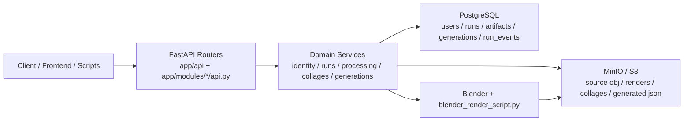
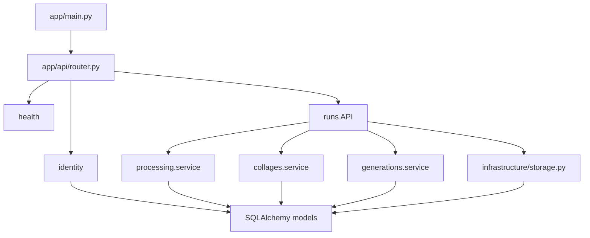
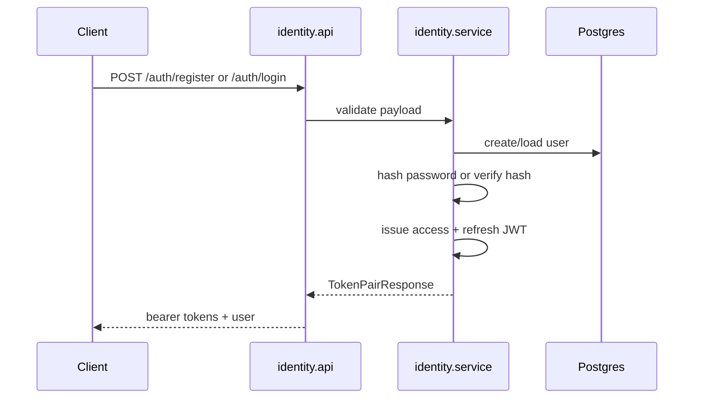
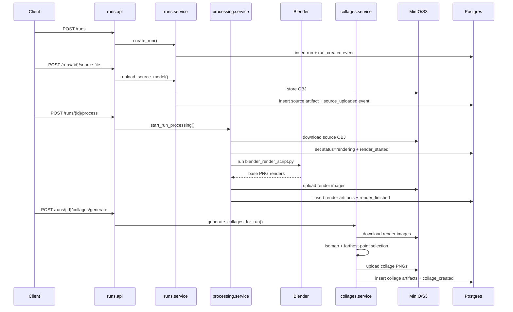
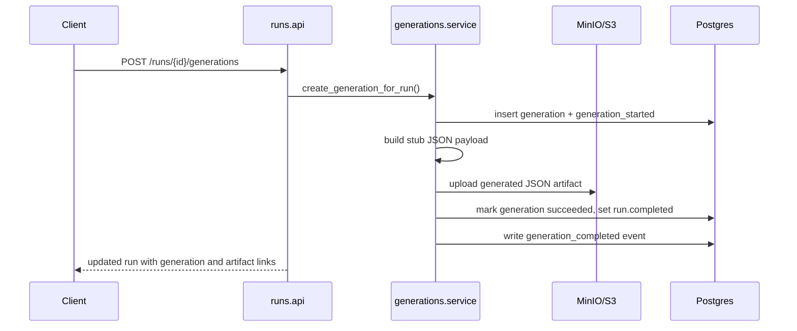
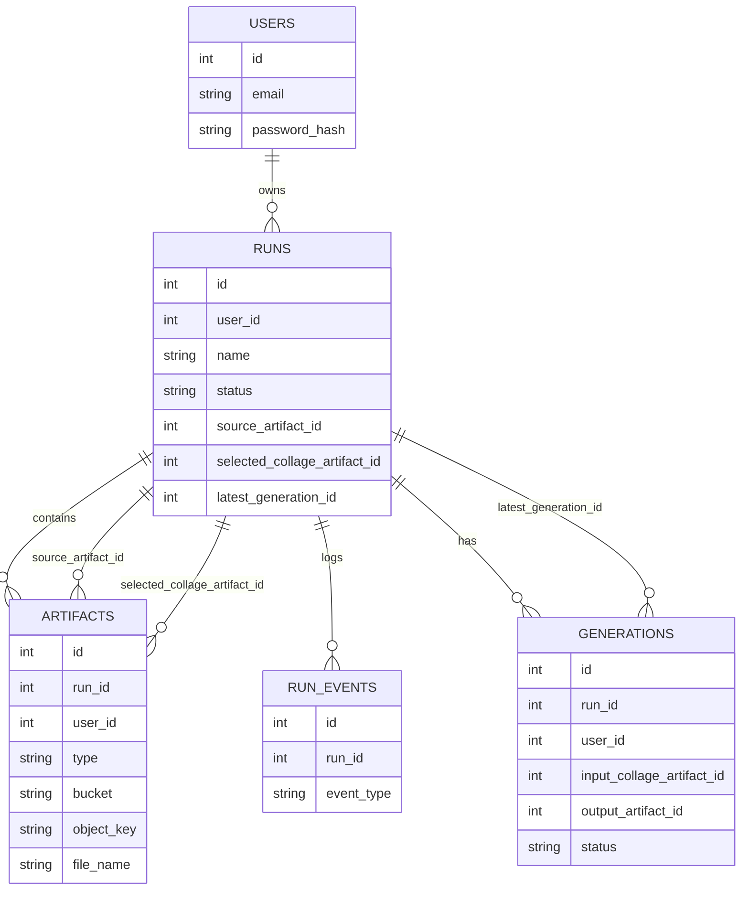

# Backend Architecture

Этот файл нужен как короткая техническая карта `backend`: что за что отвечает, куда течёт
данные и в каком порядке проходит основной pipeline.

## Layers

## Main Modules

## Request Flow

### 1. Auth

### 2. OBJ Upload -> Render -> Collage

### 3. Selected Collage -> JSON Generation

## Data Model

## Reading Order

Если нужно быстро погрузиться:

1. `backend/ARCHITECTURE.md`
2. `backend/CODEX_BACKEND_CONTEXT.md`
3. `backend/app/modules/runs/api.py`
4. `backend/app/modules/runs/service.py`
5. `backend/app/modules/processing/service.py`
6. `backend/app/modules/collages/service.py`
7. `backend/app/modules/generations/service.py`
8. `backend/app/models/*.py`
