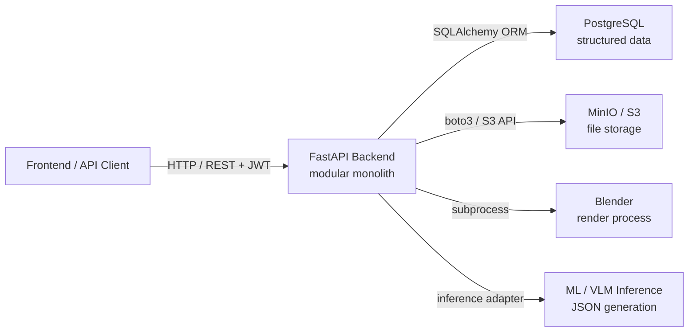
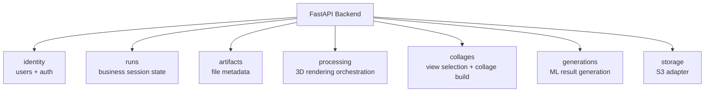
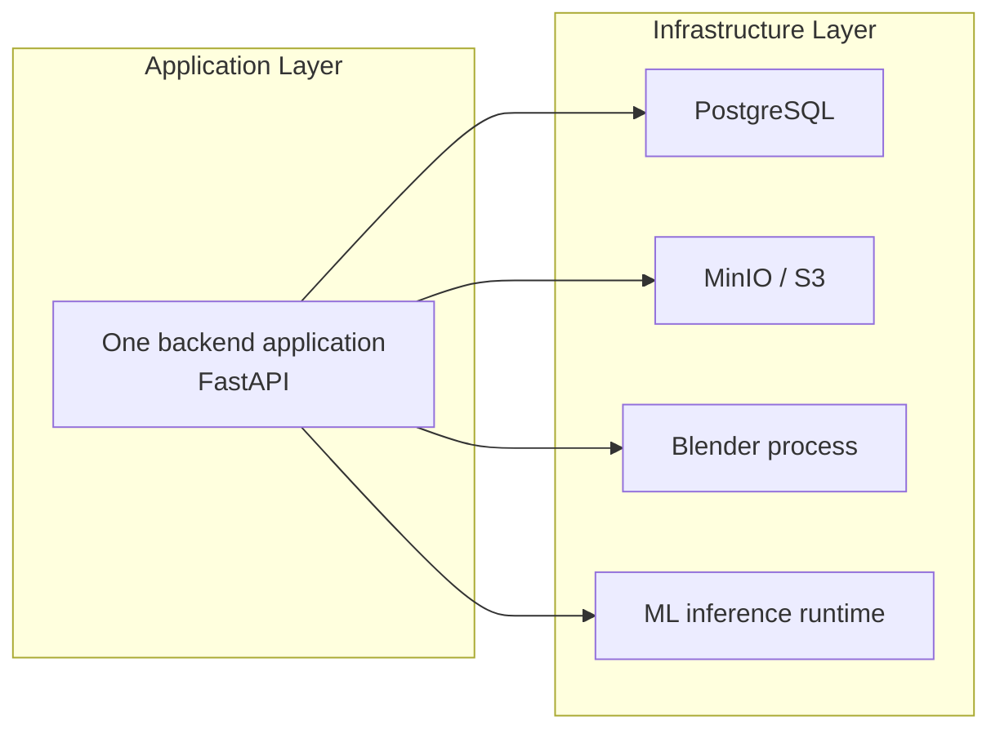
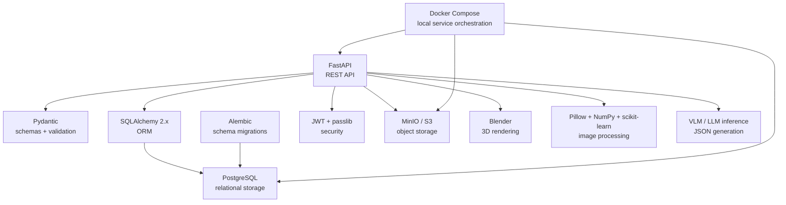
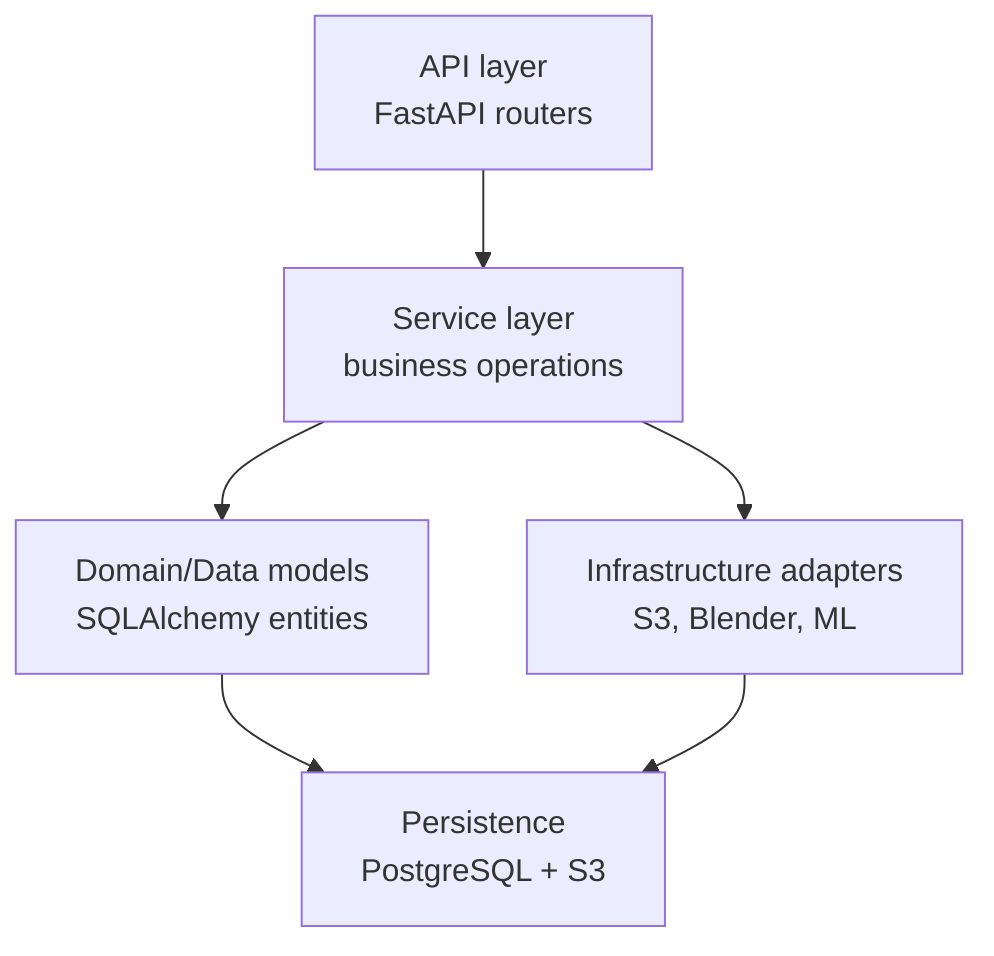
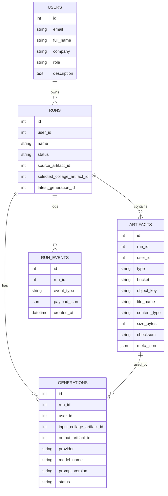
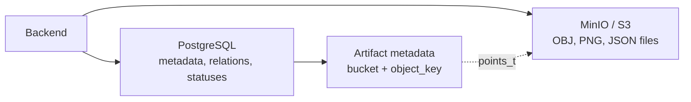
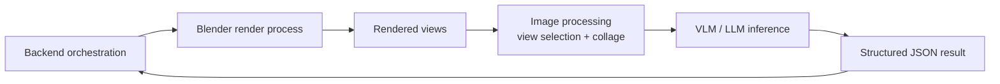
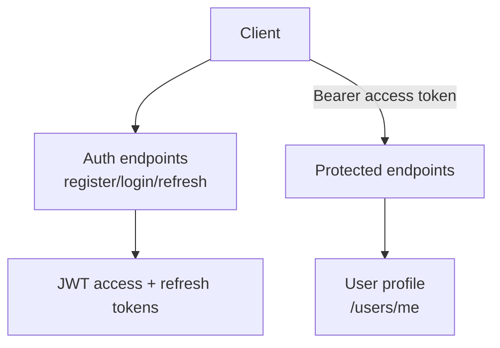

# Архитектура Бэкенда Для Презентации

Документ заточен под слайды: схема, что сказать голосом, и зачем выбраны технологии.

## Слайд 1. Архитектурная Идея

Бэкенд построен как **модульный монолит в распределённом инфраструктурном окружении**.

Это означает:
- бизнес-логика находится в одном FastAPI-приложении;
- код внутри приложения разделён на независимые доменные модули;
- база данных, объектное хранилище и Blender работают как отдельные сервисы/процессы;
- ML-компонент интегрирован как отдельный вычислительный этап генерации результата.

### Что Сказать

Архитектурно это не набор независимых микросервисов, а один backend с чётким модульным
разделением. При этом вокруг backend работают отдельные инфраструктурные компоненты:
PostgreSQL, S3-compatible хранилище и Blender.

Такой подход даёт баланс: бизнес-логика остаётся централизованной и проще согласуется, но
тяжёлые задачи и данные вынесены в специализированные компоненты.

## Слайд 2. Почему Модульный Монолит

### Что Сказать

Мы выбрали модульный монолит, потому что основные операции связаны одной предметной областью:
пользователь, модель, артефакты, статусы обработки и результат генерации.

Разделять это на независимые backend-сервисы слишком рано: пришлось бы поддерживать сетевые
контракты, распределённые ошибки и синхронизацию состояний между сервисами.

Вместо этого код разделён на модули по ответственности. Это сохраняет простоту монолита,
но не превращает код в один большой слой без границ.

## Слайд 3. Распределённый Монолит Или Нет

### Что Сказать

Термин "распределённый монолит" здесь можно использовать аккуратно.

Система распределена на уровне инфраструктуры: база, файловое хранилище, рендер и ML
работают отдельно от backend. Но бизнес-логика не размазана по нескольким сервисам, она
собрана в одном приложении.

Поэтому более точная формулировка: **модульный монолит с распределённой инфраструктурой**.

Blender запускается не как поток внутри Python, а как отдельный процесс операционной системы.
Backend управляет им через `subprocess`: передаёт входные файлы, ждёт завершения и забирает
результаты рендера.

## Слайд 4. Технологический Стек

### Что Сказать

FastAPI выбран как основной backend-фреймворк, потому что он хорошо подходит для typed API:
быстрая разработка, OpenAPI-документация из коробки, удобная интеграция с Pydantic.

Pydantic отвечает за строгие схемы входа и выхода. Это снижает риск неявных контрактов между
frontend и backend.

SQLAlchemy используется как ORM-слой, Alembic - для контролируемых миграций схемы БД.

PostgreSQL выбран для структурированных бизнес-данных: пользователи, статусы, связи,
метаданные и история событий.

MinIO/S3 выбран для файлов, потому что OBJ, PNG и JSON-артефакты лучше хранить в объектном
хранилище, а не внутри реляционной базы.

Blender используется как промышленный инструмент 3D-рендера. Backend не реализует рендер
самостоятельно, а оркестрирует готовый движок.

Pillow, NumPy и scikit-learn используются для обработки изображений, построения embedding и
выбора информативных ракурсов.

ML/VLM-компонент отвечает за генерацию технологического JSON по визуальному представлению
модели.

## Слайд 5. Слои Ответственности

### Что Сказать

Архитектура разделена на несколько слоёв.

API layer принимает HTTP-запросы, проверяет авторизацию и вызывает сервисы.

Service layer содержит бизнес-операции: создание сущностей, смену статусов, создание
артефактов, запись событий, запуск рендера и генерации.

Models описывают структуру данных и связи между сущностями.

Infrastructure adapters изолируют работу с внешними компонентами: S3, Blender и ML.
Это важно, потому что внешние интеграции можно менять без переписывания API-слоя.

## Слайд 6. Модель Данных

### Что Сказать

В базе хранится не бинарный контент, а структура процесса.

`users` отвечает за аккаунт и профиль.

`runs` - центральная сущность состояния обработки.

`artifacts` - универсальная таблица для файлов. Один механизм покрывает исходные OBJ,
рендеры, коллажи и JSON-результаты.

`run_events` дают аудит и наблюдаемость: можно восстановить, какие операции происходили.

`generations` фиксируют ML-запуски: входной артефакт, модель, версию промпта, статус и
результирующий JSON.

## Слайд 7. Почему Postgres + S3

### Что Сказать

PostgreSQL и S3 решают разные задачи.

PostgreSQL нужен там, где важны связи, индексы, транзакции и консистентность: пользователи,
статусы, история событий, связи между артефактами и генерациями.

S3 нужен для тяжелых файлов. OBJ-модели и PNG-изображения не должны храниться в таблицах.
Объектное хранилище лучше масштабируется для бинарных данных и даёт удобный механизм
presigned URL.

`download_url` в API - это временная ссылка на объект в S3. Backend контролирует доступ и
выдаёт ссылку, а сам файл клиент скачивает напрямую из объектного хранилища.

## Слайд 8. Render И ML Как Вычислительные Компоненты

### Что Сказать

Backend не выполняет все вычисления своими силами. Он оркестрирует специализированные
компоненты.

Blender отвечает за 3D-рендер. Это сильнее и надёжнее, чем писать собственный render engine.

После рендера backend использует image processing: приводит изображения к единому виду,
строит числовое представление и выбирает информативные ракурсы.

ML-компонент получает визуальное представление детали и генерирует структурированный JSON с
технологическим результатом.

Такое разделение удобно: backend управляет состоянием и данными, а специализированные
компоненты выполняют вычислительно сложные задачи.

## Слайд 9. Авторизация И Контракты API

### Что Сказать

API использует JWT-авторизацию.

Access token применяется для защищённых запросов, refresh token - для обновления сессии.

В ответах авторизации backend возвращает не только токены, но и профиль пользователя. Это
упрощает frontend: после login/register он сразу получает данные для интерфейса.

Контракты API описаны через Pydantic-схемы. Благодаря этому OpenAPI-документация
генерируется автоматически.

## Слайд 10. Почему Такой Подход Выбран

### Основные Причины

- **Простая эксплуатация:** один backend-сервис проще сопровождать, чем набор мелких сервисов.
- **Чёткие границы модулей:** код разделён по доменным зонам, поэтому архитектура не превращается
  в неструктурированный монолит.
- **Подходящее хранение данных:** Postgres хранит отношения и статусы, S3 хранит файлы.
- **Готовые специализированные инструменты:** Blender отвечает за рендер, ML-компонент - за
  генерацию результата, backend - за оркестрацию и состояние.
- **Расширяемость:** render, collage и generation изолированы в отдельных модулях, поэтому их
  можно развивать независимо.
- **Наблюдаемость:** `run_events` фиксируют историю операций и помогают объяснять состояние
  системы.

### Что Сказать

Главная причина выбора такой архитектуры - разделить ответственность без избыточного дробления.

Backend остаётся центром бизнес-логики и API-контрактов. Postgres, S3, Blender и ML-компонент
используются там, где они сильнее всего: хранение структурированных данных, хранение файлов,
3D-рендер и интеллектуальная генерация результата.

## Готовый Доклад На 2-3 Минуты

Архитектура backend построена как модульный монолит в распределённом инфраструктурном
окружении.

Это означает, что бизнес-логика находится в одном FastAPI-приложении, но внутри приложение
разделено на модули по ответственности: авторизация и профиль, управление состоянием
обработки, артефакты, рендеринг, коллажи и ML-генерация результата.

Мы не выносили каждый модуль в отдельный микросервис, потому что эти части сильно связаны
общей моделью данных и общими статусами. Один backend проще поддерживать, тестировать и
согласовывать. При этом архитектура не является плоским монолитом: модули имеют понятные
границы и взаимодействуют через сервисный слой.

Вокруг backend работают отдельные инфраструктурные компоненты. PostgreSQL хранит
структурированные данные: пользователей, статусы, связи, метаданные и историю событий.
MinIO/S3 хранит бинарные файлы: исходные модели, рендеры, коллажи и JSON-результаты. Это
разделение важно, потому что база данных подходит для отношений и транзакций, а объектное
хранилище - для тяжёлых файлов.

Blender используется как внешний вычислительный процесс для 3D-рендера. Backend запускает
его через `subprocess`, передаёт входные данные и получает изображения. ML-компонент отвечает
за генерацию структурированного JSON по визуальному представлению детали.

FastAPI выбран из-за typed API, автоматической OpenAPI-документации и удобной интеграции с
Pydantic. SQLAlchemy и Alembic дают контролируемую работу с базой и миграциями. S3 API через
boto3 даёт стандартный способ работы с файловым хранилищем и временными ссылками на скачивание.

Итоговая идея такая: backend отвечает за API, состояние и оркестрацию; Postgres - за
структурированные данные; S3 - за файлы; Blender - за рендер; ML - за интеллектуальную
генерацию результата.

